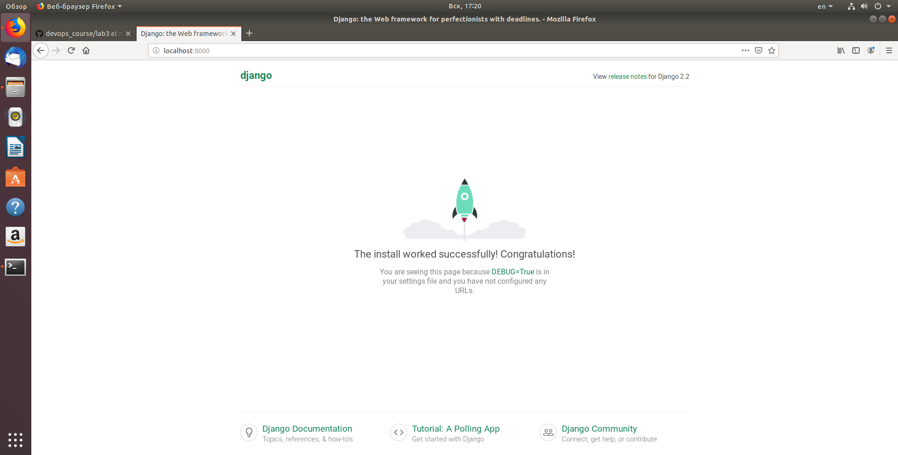
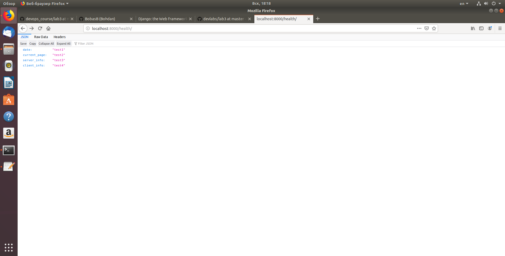

# devlabs
## Виконання лабораторної роботи:
1. За вказаними в методичці командами встановив django, запустив локальний сервер та переглянув базовий шаблон сайту.

2. Створив темплейт додатку, в якому описані всі сторінки сайту. Створив файли main.html та utls.py, заповнив їх згідно зразка в методичці. Результат:

