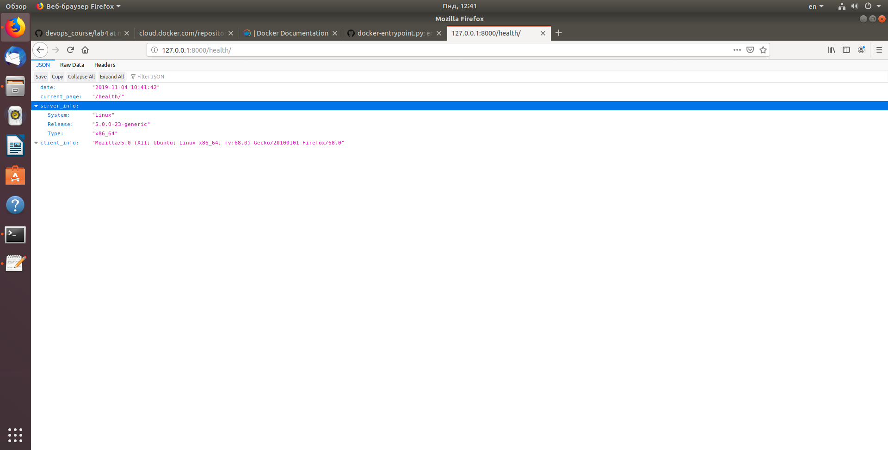

# devlabs
## Виконання лабораторної роботи:
1. Ознайомився з документацією Докер 
2. Встановив Докер за допомогою команди **sudo apt-get install docker.io**, виконав команди **docker -v , docker-h , docker run docker/whalesay cowsay Docker is fun** та перенаправив їх вихід в файл my_work.log.
3. Ознайомився з документацією Dockerfile.
4. Створив файл Dockefile, ознайомився зі структурою файлу та замінив посилання на свій репозиторій Git.
5. Створив власний репозиторій на Docker Hub за посиланням: https://cloud.docker.com/repository/registry-1.docker.io/bobas/lab4-examples
6. Виконав білд Докер імеджа, та завантажив його на репозиторій.
7. Ввів команду 
```console 
docker run -it --name=django --rm -p 8000:8000 bloodkey/devlabs:django
```
Переконався що сайт працює


8. Створив докер файл для моніторингу, завантажив його на репозиторій та запустив одночасно сервер та моніторинг. Скопіював файл server.log з контейнера на свою машину.
