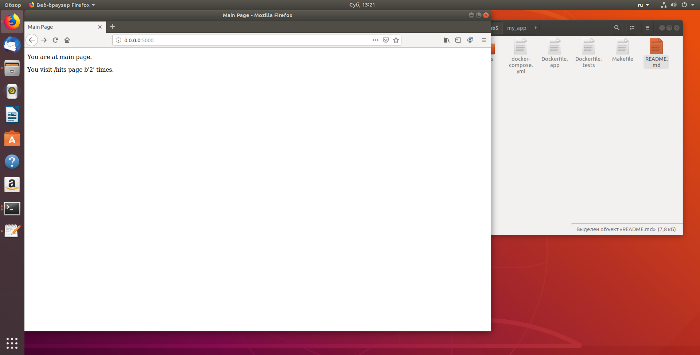
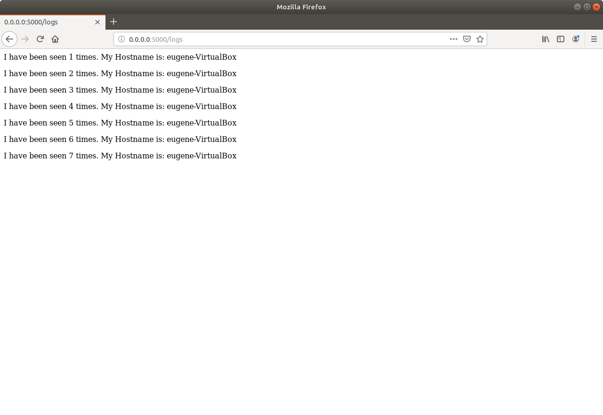
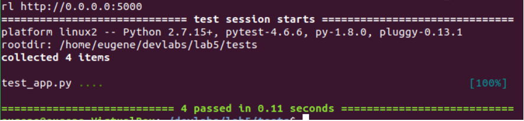
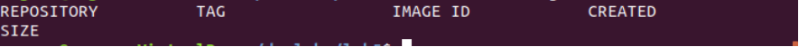

## Lab_5: Автоматизація за допомогою Makefile VS Docker Compose
1. Створив папку my_app та папку tests. Скопіював файли з цього репозиторію у відповідні папки мого репозиторію. Файл requirements.txtмістиь залежності для проекту. В залежностях додатку(my_app) цей файл містить імена наступних бібліотек, які необхідно встановити: flask та redis. Flask - це фреймворк для веб-додатків. Redis - це бібліотека, яка реалізує сховище для структурованого зберігання даних в пам'яті. Файл tests/requirements.txt містить наступні залежності: requests та pytest - це бібліотека яка спрощує роботу з запитами та бібліотека для тестування додатків відповідно.
2. Перевiрив проект на працездатність, виконав наступні команди:
pipenv --python 3.7
pipenv install -r requirements.txt
pipenv run python app.py
3. Сервер запустився, проте видав помилки. Виправивши помилки, бачимо що сторiнки працюють.

4. Перевiрив виконання тестiв, всi тести пройшли успiшно.

5. Видалив файли створенi пiсля запуску.
6. Розписую призначення директив зазначених у файлi makefile:

    STATES := app tests - присвоює змінній STATES розширений діапазон значень (app, tests), які перебираються при виконанні. У даному випадку оператор присвоєння має вигляд := - це означає, що значення буде присвоєно на момент декларації (об'явлення) змінної. Наприклад присвоєння через просте = присвоїть значення змінній тільки на момент виконання. В даній змінній описані назви так званих таргетів (targets) або цілей, іменя яких позначають яку ціль має виконати make.
    REPO := ... - присвоюємо змінній назву нашого докер-хабу000i
    .PHONY: $(STATES) - Зазвичай утиліта make вважає, шо цілі (targets) є файлами, вони використовуються щоб створювати файли з інших файлів, але прописавши таку команду, ми вказуємо утилііті make. що цілі є "несправжніми", тобто вони не являються файлами.
    $(STATES): - прив'язує команди app та tests до певного правила, інструкції до якого прописані нижче з відступом. Виконання цього правила можна запустити шляхом вказання його назви, в даному випадку до цього правила прив'язано дві назви (app та tests);
    @docker build -f Dockerfile.$(@) -t $(REPO):$(@) . - дана команда створює новий контейнер з контексту (файлів, що повинні використовуватися в майбутньому контейнері, в даному випадку в якості файлів використовуються всі, що знаходяться в даніій директорії (.) ) . В якості конфігураційного файлу для створ. контейнеру використовується Dockerfile.$(@). $(@) - це директива Makefile, що вказує на назву цілі (target). Так як дане правило використовується для двох різних цілей, ім'я докерфайлу буде залежати від вказаної цілі при виконанні make. Наприклад у випадку make app - файл буде мати назву Dockerfile.app. Прапорець -t вказує назву імеджу (image) контейнера та задає для нього тег (після :).
    run - Дане правило виконує створення мережі для подальшої можливої взаємодії контейнерів між собою (docker network create --driver=bridge appnet). Далі ми запускаємо сервер-сховище (Redis) та раніше створений контейнер app. Параметр --rm - вказує на те, що контейнер буде видалено після закінчення його роботи, або по завершенню docker-процесу (daemon). --name - задає human readable (читабельне) ім'я контейнеру, що є необхідним якщо ми хочемо зробити щось з цим контейнером в майбутньому ми зможемо звернутись до нього за іменем. --net= - задає ім'я мережі, яку має використовувати контейнер, в даному випадку це раніше створена мережа appnet. Прапорець -d вказує на те, щоб контейнер запускався в бекграунді (background), тобто у фоновому режимі. Параметр -i (--interactive) та -t (--tty) створюють інтерактивний режим з прив'язкою до терміналу. В такому режимі можна взаємодіяти з контейнером та виконувати команди всередині контейнера. -p 5000:5000 - вказує що контейнер буде прив'язано до 5000 порту на машині на якій він запущений (5000:) та внутрішній порт контейнера (:5000).
    docker-prune - Це правило описує видалення всіх раніше створених ресурсів, сховищ, контейнерів та мереж.
7. Запустив команди make app & make tests, та запустив проект за допомогою make run.
8. Завантажив iмеджi на докер-хаб репозиторiй, видалив локальнi iмеджi.

9. Створив файл docker-compose.yml, оновив docker-compose, оскiльки команда не працювала. Запустив на виконанная, переходити на сайт потрiбно за посиланням: 0.0.0.0:80
10. На мою думку, краще використовувати makefile оскiльки його можно бiльш гнучко налаштувати пiд потреби користувача.
11. Створив docker-compose для лабораторноi роботи №4
